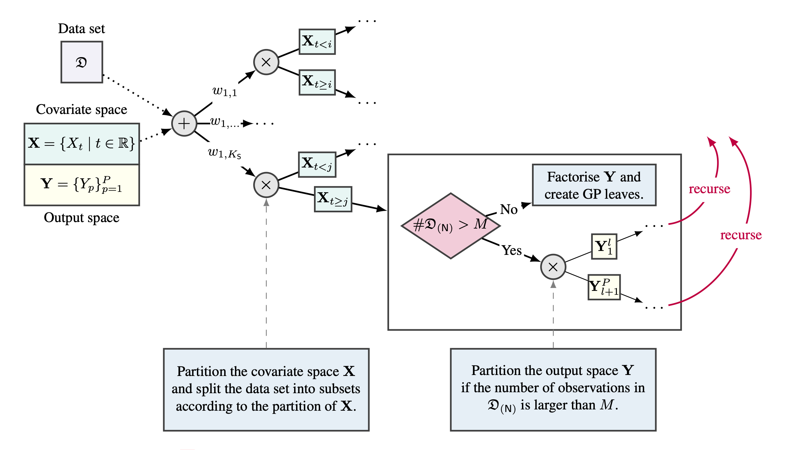

# MOMoGP

This is the official repository for MOMoGP introduced in 
[Leveraging Probabilistic Circuits for Nonparametric Multi-Output Regression](https://ml-research.github.io/papers/yu2021uai_momogps.pdf) by Zhongjie Yu, Mingye Zhu, Martin Trapp, Arseny Skryagin, and Kristian Kersting, to be published at UAI 2021.

## Setup

This will clone the repo, install a Python virtual env (requires Python 3.6), the required packages, and will download some datasets.

    git clone https://github.com/minimrbanana/MOMoGP
    ./setup.sh

## Demos

To illustrate the usage of the code:

    source ./venv_momogp/bin/activate
    python run_MOMoGP.py --data=parkinsons

"parkinsons" can be replaced with "scm20d" or "wind" or "energy" or "usflight".

### Hyperparameters

If not specified, the corresponding hyperparameters are set by default values.
If train on CPU, use:

    python run_MOMoGP.py --data=parkinsons --cpu

## Citation
If you find this code useful in your research, please consider citing:

    @inproceedings{yu2021uai_momogps,
      title = {Leveraging Probabilistic Circuits for Nonparametric Multi-Output Regression},
      author = {Yu, Zhongjie and Zhu, Mingye and Trapp, Martin and Skryagin, Arseny and Kersting, Kristian},
      booktitle = {Proceedings of the 37th Conference on Uncertainty in Artificial Intelligence (UAI)},
      year = {2021}
    }

## Acknowledgments

* This work is supported by the Federal Ministry of Education and Research (BMBF; project "MADESI", FKZ 01IS18043B, and Competence Center for AI and Labour; "kompAKI", FKZ 02L19C150), the Hessian Ministry of Higher Education, Research, Science and the Arts (HMWK; projects "The Third Wave of AI" and "The Adaptive Mind"), the Hessian research priority programme LOEWE within the project "WhiteBox", and the National Research Center for Applied Cybersecurity ATHENE, a joint effort of BMBF and HMWK. M.T. acknowledges funding from the Academy of Finland (grant number 324345).

* The code is developed based on the Python implementation of DSMGP from [Eugene](https://github.com/eugene/spngp).

